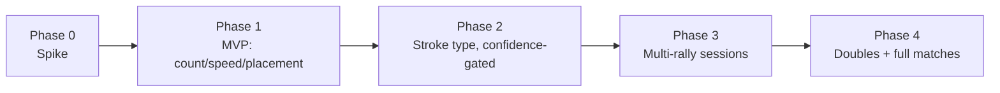

# AI Match Video Analysis — Implementation Plan

2026-09-29 · Companion to the [AI Match Video Analysis — Feature Proposal](https://claude.ai/code/artifact/401f6d3d-74e2-41fc-923c-fae9e5a064c2) doc (also mirrored as a Claude Doc: https://claude.ai/code/artifact/5fe4bc71-b447-4707-bc41-b113e9041b29)

## Purpose

The feature proposal doc covers *why* and *what* — the pipeline, the tech stack, the repos evaluated, and the phased scope. This doc covers *how to build it*: concrete engineering tasks, ownership by system (backend / CV service / mobile), and exit criteria per phase, so a phase is done when its criteria are met, not when it feels finished.

Scope matches the proposal's revised phasing: ship the reliable parts (stroke count, speed, court placement) before the unsolved one (stroke type), and solo sessions before doubles and full matches.

## Shared engineering components

Built once in Phase 0/1, reused by every later phase.

| Component | System | Notes |
| --- | --- | --- |
| Video upload (file, not URL) | Mobile (Flutter) + Nest backend | Same file-upload pattern already used for club-admin media |
| Object storage for videos | Backend infra | S3-compatible bucket, private, signed URLs |
| Job queue | Nest backend | BullMQ (Redis-backed), fits the existing Node/Nest stack |
| `VideoAnalysisJob` table | Prisma schema | status, video ref, phase/version that produced it, timestamps |
| `StrokeEvent` table | Prisma schema | job ref, type (nullable until Phase 2), timestamp, speed, placement x/y, confidence |
| Python CV service | New standalone service (FastAPI) | Wraps ball tracking, court detection, player tracking; GPU-backed; internal endpoint the Nest backend calls |
| Validity gate | CV service | Refuses low-confidence clips with a specific reason, never a fabricated result (Tennis-Vision pattern) |
| Push notification + results screen | Mobile (Flutter, native) | Native video player + `CustomPainter` overlays, per the architecture decision |

The CV service is versioned independently of the backend release cycle, since its models improve on their own schedule (new training data, better classifiers) separate from app releases.

## Phase 0 — Spike

Goal: find out whether existing open-source models work at all on Drift's actual camera domain, before writing any product code.

**Status (2026-09-29):** environment vendored and verified; blocked on user-supplied real clips for the actual go/no-go.

**Tasks**

- [x] Evaluate open-source repos and vendor a base pipeline — four reviewed (`grohan1130/TennisCV`, `lyomu/TennisCoach`, `yastrebksv/TennisProject`, `HarshTomar1234/Tennis-Vision`), picked **Tennis-Vision** (MIT, the only one with a licence and any stroke classification attempt) and vendored it into `cv-service/` (plain copy, not a submodule, from `lyomu/Tennis-Vision` @ `v2.1.1`); see `cv-service/DRIFT_CHANGES.md`
- [x] Verify the environment itself runs — venv, CUDA torch (RTX 4060, `torch==2.14.0+cu126`), all model weights fetched, full 9-stage pipeline run clean end to end on Tennis-Vision's own bundled sample clip; see `cv-service/README.md` "Verified". Not yet evidence it works on Drift's own footage — that's the next task
- [ ] Collect 15-20 sample clips ourselves: phone-recorded, courtside/fence-side, varying distance, angle, and lighting
- [ ] Run Tennis-Vision's ball tracking, court detection, and player tracking against them as-is (no fine-tuning yet)
- [ ] Score how often the court-validity gate passes vs. refuses on our footage
- [ ] Manually label ground truth on those clips (ball contacts, stroke type) for a rough accuracy check

**Exit criteria**

- [ ] Court detection passes the validity gate on at least half of sample clips — if it fails on nearly all of them, fine-tuning scope for Phase 1 grows significantly and the timeline needs revisiting
- [ ] A documented go/no-go with numbers, not a feeling

## Phase 1 — MVP: count, speed, placement

Scope: solo sessions only (drills, serve practice, one-on-one rallies), single continuous takes. No stroke-type label yet.

**Backend**

- [ ] Prisma migration: `VideoAnalysisJob`, `StrokeEvent`
- [ ] Upload endpoint (file upload to object storage) + job enqueue
- [ ] Webhook/callback endpoint for the CV service to post results back
- [ ] Push notification on job completion

**CV service**

- [ ] Fine-tune court detection and ball tracking on Phase 0's labeled clips (or a larger version of that set)
- [ ] Wire up the validity gate with a specific, user-facing refusal reason per failure mode
- [ ] Ball-contact event detection (count only, no type)
- [ ] Speed calculation for bounded flights (serve-style: known start/end), with an honest uncertainty band, not a bare number
- [ ] Court-placement mapping via homography

**Mobile**

- [ ] Upload flow (record or pick from library)
- [ ] Processing state ("analyzing…", push notification when ready)
- [ ] Results screen: stroke count, speed stats, placement scatter — native video player + `CustomPainter` overlays, no WebView

**Acceptance criteria**

- [ ] A clip that fails the validity gate shows the user a specific reason, never a silent failure or a fabricated stat
- [ ] Speed numbers are shown with their uncertainty, not as a bare figure
- [ ] End-to-end: upload → job → push notification → results screen, on a real device, on our own test footage

## Phase 2 — Stroke type (confidence-gated)

The highest-risk phase. Every reviewed repo either skips this or scores near chance on it, so this phase is scoped as R&D with a hard go/no-go, not a guaranteed ship.

**Tasks**

- [ ] Build a labeling tool (or adapt an open one) for our own team/beta users to tag forehand/backhand/serve/volley on real Drift footage
- [ ] Collect a labeled set from Phase 1's real usage — our own domain, not THETIS or broadcast video
- [ ] Add racket detection as a feature (racket-face orientation at contact), not just body pose
- [ ] Train a classifier on a short temporal window of poses leading into contact, not a single frame
- [ ] Set an explicit accuracy bar before shipping (e.g. balanced accuracy on held-out Drift footage, not on a benchmark dataset)
- [ ] Ship stroke type only above that bar; otherwise it stays unlabeled rather than shown wrong with false confidence

**Acceptance criteria**

- [ ] Classifier accuracy measured on held-out **Drift** footage, not training-domain benchmarks
- [ ] If the bar isn't cleared, the phase ends in a documented no-go rather than shipping a weak label silently

## Phase 3 — Multi-rally sessions

Removes the "single trimmed rally only" constraint so users can upload a whole practice session.

**Status (2026-09-30):** built across all three layers; mechanism verified by design and by
tests, boundary accuracy unverified because no multi-rally footage exists. See `PROGRESS.md`
and `cv-service/DRIFT_CHANGES.md`.

**Tasks**

- [x] Build an "is play happening" pre-pass to find rally boundaries in a longer video — `cv-service/utils/rally_segmenter.py`. **Deviates from "ball and player motion" deliberately:** ball detection was measured at 0-25% of frames on real Drift clips (`cv-service/PHASE0_FINDINGS.md`) and TrackNet is half the pipeline's runtime, so the signal is court validity plus residual subject motion instead. Player detection is applied to candidate spans only, not to the whole session, so its cost scales with play rather than with session length
- [x] Auto-chunk a session into individual rally segments — hysteresis, gap merging, context padding and a minimum length, in that order, streaming at most three frames at a time
- [x] Run the Phase 1/2 pipeline per segment — `cv-service/session.py`, one subprocess per rally, under a frame budget
- [x] Aggregate stats across the whole session in the results screen (per-rally breakdown + session totals) — `cv-service/utils/session_aggregate.py`, `POST /analyze-session`, and the session view in `mobile/lib/features/video_analysis/presentation/video_results_screen.dart`

**Acceptance criteria**

- [ ] A 10+ minute session video is correctly split into rally segments without manual trimming — **not met and not refuted.** No multi-rally footage exists on this machine; the two available clips are 7s and 19s of broadcast, and the Phase 0 re-shoot has not happened. `cv-service/tools/make_session_clip.py` builds a synthetic session with exact ground truth and `cv-service/eval/rally_segmentation_accuracy.py` scores against it, which measures the mechanism and explicitly not whether the thresholds suit real footage. Every threshold is marked `provisional` in its own output
- [x] Session-level aggregation matches the sum of its per-rally parts — asserted on the shipped object by `session_totals_match_parts`, for **counts**. Speed averages are deliberately *not* the sum of their parts: they are weighted by the shots that produced them, because a mean of per-rally means weights a one-shot rally exactly as heavily as a twelve-shot one

**One finding that bears on Phase 4's runtime note.** The runtime problem Phase 4 flags for full
matches already binds here: at the measured ~0.63 s/frame, a 10-minute session is ~3 hours end
to end, and ~1.6 hours even after segmentation, on a service with one GPU. Session mode
therefore runs under an explicit frame budget and reports every rally it found alongside the
ones it measured. Phase 4 will need the same arithmetic done before, not after.

## Phase 4 — Doubles and full matches

The broadest, lowest-priority phase — scoped last deliberately.

**Tasks**

- [ ] Multi-player tracking (up to 4 players) replacing the singles "one player per side" assumption
- [ ] Per-shot attribution: which player hit it
- [ ] Point/game boundary detection for full-match uploads
- [ ] Revisit runtime budget — a full match at current processing speeds is impractical; needs its own performance pass

**Acceptance criteria**

- [ ] Correct player attribution on a labeled doubles test set
- [ ] A full match processes within a defined time budget, not just "eventually finishes"

## Risks & mitigations

| Risk | Mitigation |
| --- | --- |
| Existing models don't transfer to amateur camera footage at all | Phase 0 spike is a hard gate before Phase 1 engineering starts |
| Stroke classification never clears an acceptable accuracy bar | Phase 2 scoped as R&D with an explicit no-go outcome; Phase 1 ships without it |
| GPU processing cost/latency makes the feature impractical at volume | Start with a hosted inference option to validate demand before committing to self-hosted GPU infra (see build vs. buy in the proposal doc) |
| Users upload footage outside supported frame rate/conditions | Validity gate refuses with a specific reason rather than reporting wrong numbers |
| Uploaded video shows identifiable bystanders/opponents | Storage/retention and consent policy needed before public launch (carried over from the proposal doc's open questions) |

This plan is a companion to the feature proposal doc; phase scope changes should be reflected in both.
